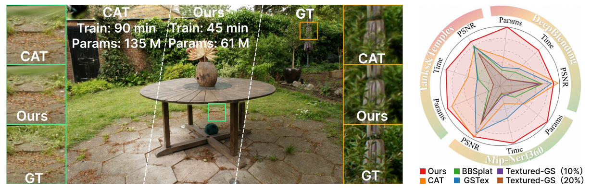

# LiteTex-GS: Fast and Lightweight Texturing for Gaussian Splatting



This repository contains the implementation of **LiteTex-GS**, a fast and lightweight texturing framework for Gaussian Splatting.
LiteTex-GS decouples high-frequency appearance from the geometric scaffold by assigning compact local textures to Gaussian primitives and progressively allocating higher texture resolution only where reconstruction errors indicate that more capacity is needed.

The method uses a global-to-local capacity allocation strategy: a frequency-aware scheduler controls the training resolution, texture-resolution cap, and densification rate, while local error statistics decide which primitives receive additional texture capacity.
To keep the representation compact, LiteTex-GS further prunes low-utility primitives using contribution- and area-aware criteria and applies a resolution-aware texture update rule for stable optimization after texture growth.

Experiments on standard novel view synthesis benchmarks show that LiteTex-GS maintains competitive rendering quality while reducing both training time and total parameter count compared with existing textured Gaussian baselines.

This codebase builds on the original Gaussian Splatting project and the texturing pipeline from Content-Aware Texturing for Gaussian Splatting.

## Installation

### Clone the repository
Make sure that submodules are also checkout out by adding the `--recursive` flag.

```shell
# SSH
git clone git@github.com:insightlab-CG-3DV/LiteTex-GS.git --recursive
```
or
```shell
# HTTPS
git clone https://github.com/insightlab-CG-3DV/LiteTex-GS.git --recursive
```

### Create and set up the environment
Create a conda environment with:
```shell
conda create -n lite_tex python=3.12
conda activate lite_tex
```

Run the installation script that should take care of everything
```shell
python install.py
```

At the end make sure that the torch has been installed with cuda support.

`python -c "import torch;print(torch.cuda.is_available())"`

should print `True`. If that's not the case the installation of the submodules might also fail.

## Training
You can train the model with default settings on any COLMAP dataset by running the following command.
```shell
python train.py -s <PATH TO COLMAP DATASET> -m <OUTPUT_DIR>
```

This work has introduced some new hyperparameters that may need to be tuned depending on the dataset and available system resources (e.g. memory). Below is a comprehensive list, with intuition on what the expected effect of each one is. A comparison is provided in **Appendix B** of the paper.
<details>

</details>

## Evaluation

The base model, along with all other models included in the paper can be trained using the `full_eval.py` script, that contains their exact configurations.
Note that there was an oversight regarding the texture regularisation while writing the paper that went unnoticed until the cleaning and release of the code.
In the paper, it is mentioned that the texture regularisation is an L1 loss.
In the code, however, this loss is actually weighted by the transmittance of the primitive (averaged over the pixels touched) for the specific view, which can range from 0 to 1.
The intuition behind it is that we want to regularise hidden primitives (contribution closer to 0) more, to save on memory and visible ones (contribution closer to 1) less, to actually learn the intricate details of the scene.
We ran the experiment without it and, with the same value of `lambda_texture_regul`, the quality metrics are a bit worse, because of the over-regularisation of the highly contributing primitives. Lowering the strength of the regularisation fixes the metrics but the model uses 10% more paremeters, because background/hidden primitives are not regularised and downscaled enough.

To evaluate a model run the following command:
```shell
python full_eval.py --output_path <OUTPUT_DIR> -m360 <PATH TO MIP-NERF360 DATASET> -tat <PATH TO TANKS & TEMPLES DATASET> -db <PATH TO DEEPBLENDING DATASET>
```

Additional command line arguments control which model to evaluate or which scenes. More information using `python full_eval.py --help`.

## Viewer

The codebase uses the [graphdeco viewer](https://github.com/graphdeco-inria/graphdecoviewer), which is a python based viewer that is very easy to integrate and extend. To view a trained model run the following command
```shell
python viewer.py -m <OUTPUT_DIR> [-s <PATH TO SCENE>] local 30000
```
