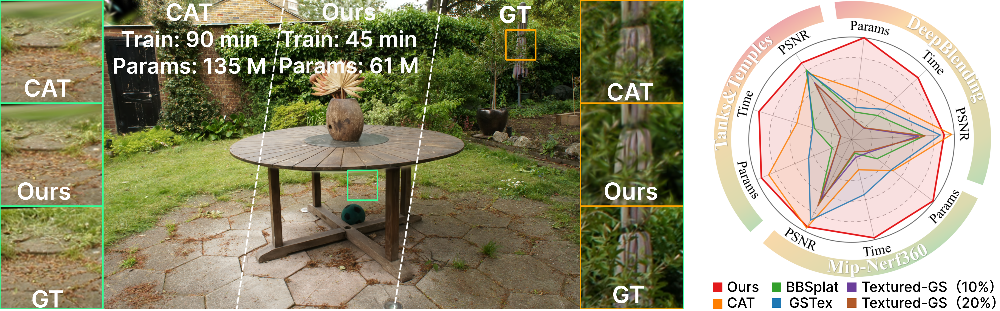

# 🎨 LiteTex-GS: Fast and Lightweight Texturing for Gaussian Splatting

> Zhiwei Li<sup>†</sup>, Yijia Guo<sup>†</sup>, Yishi Lu, Liwen Hu, Hong Rao<sup>*</sup>, Shengbo Chen<sup>*</sup>, Lei Ma<sup>*</sup>
>
> <sup>†</sup>Equal contribution &nbsp;&nbsp; <sup>*</sup>Corresponding authors

This repository contains the official implementation associated with the paper **"LiteTex-GS: Fast and Lightweight Texturing for Gaussian Splatting"**, accepted to the **Pacific Graphics 2026 Journal Track** and published in *Computer Graphics Forum*.

## 🔥 News

- **[2026/08] Congratulations! LiteTex-GS has been accepted to the Pacific Graphics 2026 Journal Track!** The official implementation is available in this repository.

## 📝 Abstract

Gaussian Splatting has enabled real-time novel view synthesis, but its tightly coupled geometry and appearance representation often require a large number of primitives to reproduce high-frequency texture details, leading to substantial memory and optimization costs. Recent textured 2D Gaussian methods alleviate this limitation by attaching texture maps to Gaussian primitives. However, bridging the fundamental structural gap between discrete Gaussians and continuous 2D grids requires complex parameterizations that introduce severe computational overhead. This overhead fundamentally compromises the original efficiency of Gaussian Splatting, making the balance between detailed texturing and computational agility an unresolved challenge.

To address these challenges, we propose **LiteTex-GS**, a fast and lightweight texturing framework for Gaussian Splatting. Our method initializes an extremely compact representation by assigning minimal local texture to each Gaussian and progressively allocates higher resolution only to primitives with significant reconstruction errors. To maintain a streamlined geometric scaffold, we introduce a contribution- and area-aware pruning strategy that eliminates low-utility Gaussians. Furthermore, to mitigate the gradient dilution caused by texture upsampling, we design a resolution-aware update rule that preserves rapid and stable convergence. Extensive experiments on standard novel view synthesis benchmarks demonstrate that our method achieves competitive or superior rendering quality while using substantially fewer parameters and less training time than existing textured Gaussian baselines.

## 👀 Overview



**Figure 1.** Left: Qualitative comparison on a representative Mip-NeRF 360 scene. Two zoom-in regions compare LiteTex-GS mainly with CAT, with ground truth as reference; the average training time and total parameter count on Mip-NeRF 360 are annotated below each method. Right: Quality-efficiency trade-off in terms of PSNR, training time, and parameter count. LiteTex-GS maintains competitive visual fidelity while substantially reducing both parameters and training time through global-to-local capacity allocation. [Download the high-resolution PDF](assets/litetex_gs_teaser.pdf).

This codebase builds on the original Gaussian Splatting project and the texturing pipeline from Content-Aware Texturing for Gaussian Splatting.

## Installation

### Clone the repository
Make sure that submodules are also checkout out by adding the `--recursive` flag.

```shell
# SSH
git clone git@github.com:insightlab-CG-3DV/LiteTex-GS.git --recursive
```
or
```shell
# HTTPS
git clone https://github.com/insightlab-CG-3DV/LiteTex-GS.git --recursive
```

### Create and set up the environment
Create a conda environment with:
```shell
conda create -n lite_tex python=3.12
conda activate lite_tex
```

Run the installation script that should take care of everything
```shell
python install.py
```

At the end make sure that the torch has been installed with cuda support.

`python -c "import torch;print(torch.cuda.is_available())"`

should print `True`. If that's not the case the installation of the submodules might also fail.

## Training
You can train the model with default settings on any COLMAP dataset by running the following command.
```shell
python train.py -s <PATH TO COLMAP DATASET> -m <OUTPUT_DIR>
```

This work has introduced some new hyperparameters that may need to be tuned depending on the dataset and available system resources (e.g. memory). Below is a comprehensive list, with intuition on what the expected effect of each one is. A comparison is provided in **Appendix B** of the paper.
<details>

</details>

## Evaluation

The base model, along with all other models included in the paper can be trained using the `full_eval.py` script, that contains their exact configurations.
Note that there was an oversight regarding the texture regularisation while writing the paper that went unnoticed until the cleaning and release of the code.
In the paper, it is mentioned that the texture regularisation is an L1 loss.
In the code, however, this loss is actually weighted by the transmittance of the primitive (averaged over the pixels touched) for the specific view, which can range from 0 to 1.
The intuition behind it is that we want to regularise hidden primitives (contribution closer to 0) more, to save on memory and visible ones (contribution closer to 1) less, to actually learn the intricate details of the scene.
We ran the experiment without it and, with the same value of `lambda_texture_regul`, the quality metrics are a bit worse, because of the over-regularisation of the highly contributing primitives. Lowering the strength of the regularisation fixes the metrics but the model uses 10% more paremeters, because background/hidden primitives are not regularised and downscaled enough.

To evaluate a model run the following command:
```shell
python full_eval.py --output_path <OUTPUT_DIR> -m360 <PATH TO MIP-NERF360 DATASET> -tat <PATH TO TANKS & TEMPLES DATASET> -db <PATH TO DEEPBLENDING DATASET>
```

Additional command line arguments control which model to evaluate or which scenes. More information using `python full_eval.py --help`.

## Viewer

The codebase uses the [graphdeco viewer](https://github.com/graphdeco-inria/graphdecoviewer), which is a python based viewer that is very easy to integrate and extend. To view a trained model run the following command
```shell
python viewer.py -m <OUTPUT_DIR> [-s <PATH TO SCENE>] local 30000
```

## 📄 Citation

If you find this project useful in your research, please consider citing:

```bibtex
@article{li2026litetexgs,
  title   = {LiteTex-GS: Fast and Lightweight Texturing for Gaussian Splatting},
  author  = {Li, Zhiwei and Guo, Yijia and Lu, Yishi and Hu, Liwen and Rao, Hong and Chen, Shengbo and Ma, Lei},
  journal = {Computer Graphics Forum},
  volume  = {45},
  number  = {7},
  year    = {2026}
}
```
